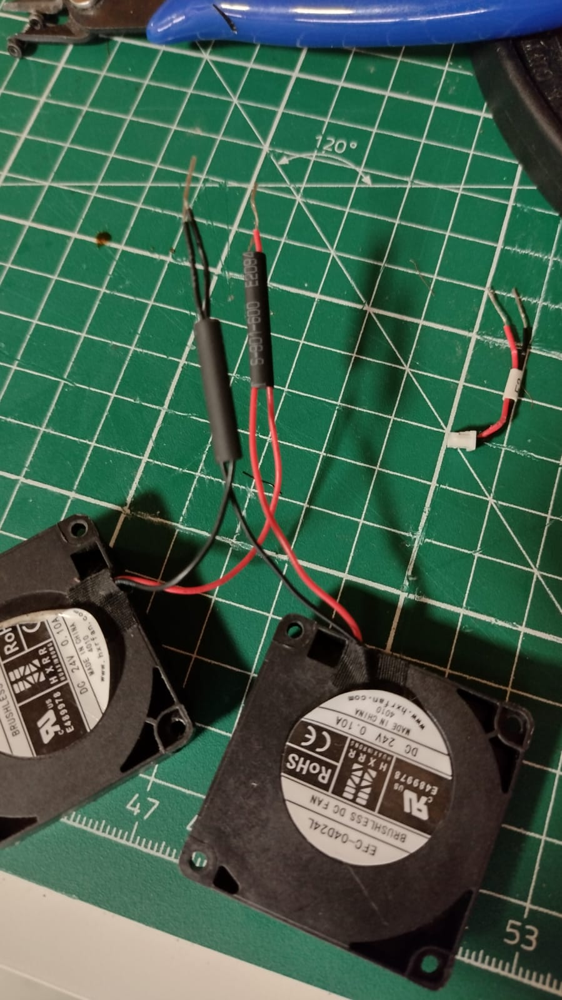
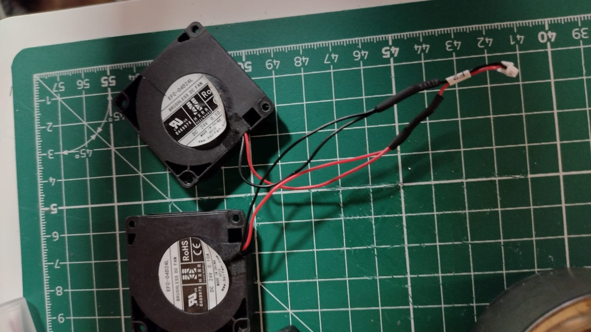

# Ender 3 V3 SE Dual Fans Upgrade

## What You Need:
- **Soldering iron** (with tin, flux, silicone mat and all the other stuff)
- **Wire cutters**
- **Heat shrink tubing**
- **Additional wire**
- **Lighter**
- **Screws/nuts/fans** (check with the BOM of the shroud you are using)
   - **2x 4010 blower fans (24V)**
   - Optional: **4010 fan for heatsink** (in my case)

---

## Step 1: Print the Shroud

There are many dual 4010 fan shrouds for the Ender 3 V3 SE. Here are some recommended options:

- [Ender3 V3 SE/KE Dual 4010 Blower Shroud (K1 Hotend)](https://www.printables.com/model/910918-ender3-v3-seke-dual-4010-blower-shroud-for-k1-hote)
- [Ender 3 V3 SE Dual 4010 Shroud](https://www.printables.com/model/619049-ender-3-v3-se-dual-4010-shroud)
- [Ender 3 V3 SE Dual 4010 Shroud (K1 Edition)](https://www.printables.com/model/776177-ender-3-v3-se-dual-4010-shroud-k1-edition)
- [Slim Ender 3 V3 SE Dual 4010 Shroud (K1 Edition)](https://www.printables.com/model/818919-slim-ender-3-v3-se-dual-4010-shroud-k1-edition)
- [Ender3 V3 SE Dual 4010 Shroud for K1/KE Hotend](https://www.printables.com/model/809391-ender3-v3-se-dual-4010-shroud-for-k1ke-hotend)

Choose one and print it. 

**Material Recommendations:**
- For ducts, use a material with a higher melting temperature than your typical print material:
   - If you print mostly PLA → Use **PETG**.
   - If you print mostly PETG → Use **ABS/ASA** (take care of health concerns).
- Be aware that the ducts may deform over time due to heat.

In my case, I chose the first option and printed it entirely in PETG.

---

## Step 2: Prepare the Fans

1. **Identify Polarity:**  
   Typically, the red wire is **+ (positive)** and the black wire is **- (negative)**.

2. **Cut and Strip Wires:**  
   - Cut the fan wires and remove the insulation at the ends.
   - Take the original fan connector and cut its wires ~2-3 cm from the connector.

   {width=60%}

3. **Twist and Prepare Connections:**  
   - Twist the exposed ends of the fan wires by polarity: **red with red**, **black with black**.  
   - Slide heat shrink tubing over the wires, ensuring it’s long enough to cover the solder joints.

   {width=60%}

4. **Extend the Wires:**  
   - Cut **2 additional wire pieces** (~10 cm each).  
   - Solder these extension wires to the fan wires.  

   *Alternatively:* Replace the fan wires entirely with longer ones by desoldering the originals and soldering new wires.

5. **Attach the Connector:**  
   - Solder the original fan connector to the ends of the extended wires.  
   - **Double-check your work:**
      - Tug the wires gently to ensure they hold.
      - Use a multimeter to check for continuity and ensure no shorts.

6. **Insulate the Connections:**  
   - Slide the heat shrink tubing over the solder joints and shrink it using a lighter, heat gun, or soldering iron.

   {width=60%}

---

## Step 3: Test the Fans

1. **Power Off the Printer:**  
   - Ensure the printer is turned off before connecting the fans.

2. **Connect the Fans:**  
   - Plug the fans into their respective ports on the printer's mainboard.

3. **Power On and Test:**  
   - Turn the printer back on.  
   - Use the printer menu or send the following **G-code command** via the console to test the fans:

      ```gcode
      M106 S255   ; Turn fans ON at full speed
      M106 S0     ; Turn fans OFF
      ```

4. **Verify Operation:**
   - If the fans spin, congratulations! 🎉 You’ve successfully wired and installed your fans.  
   - If they don’t work:
     - Stay calm.
     - Review and redo everything from **Step 2**, ensuring proper polarity and connections.

---

## Step 4: Install the Shroud

1. Mount the fans into the printed shroud using screws and nuts as specified in the BOM.  
2. Attach the assembled shroud to the printer.  

---

### **Happy Printing! 🥳**

Now that the upgrade is complete, enjoy improved cooling performance for your prints!

If you did find this helpful, I am always [here](https://buymeacoffee.com/argatuioan) ;)
