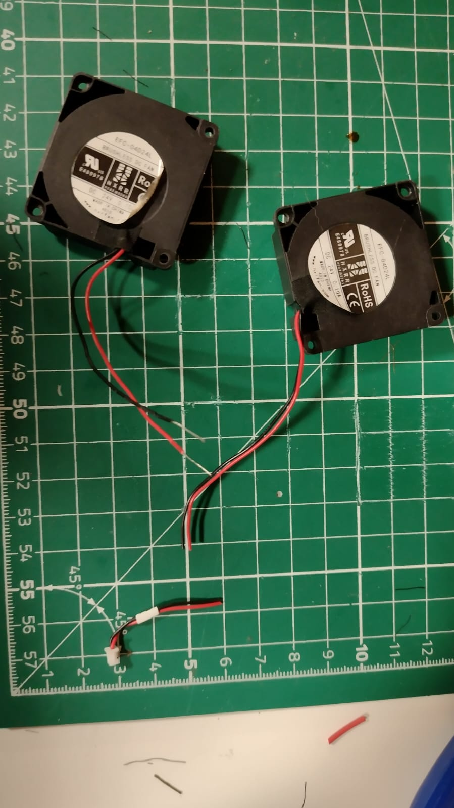

# Ender 3 V3 SE dual fans upgrade

What you need:
  - soldering iron (with tin and flux)
  - wire cutters
  - 2x4010 blower fans (24V)
  - optional 4010 fan for heatsink
  - screws/nuts (check with the BOM of the shroud you are using)

## Step 1: print the shroud

There are many dual 4010 fans shrouds for the V3 SE, and here are the ones I recommend:
  - https://www.printables.com/model/910918-ender3-v3-seke-dual-4010-blower-shroud-for-k1-hote
  - https://www.printables.com/model/619049-ender-3-v3-se-dual-4010-shroud
  - https://www.printables.com/model/776177-ender-3-v3-se-dual-4010-shroud-k1-edition
  - https://www.printables.com/model/818919-slim-ender-3-v3-se-dual-4010-shroud-k1-edition
  - https://www.printables.com/model/809391-ender3-v3-se-dual-4010-shroud-for-k1ke-hotend

Choose one and print it. Usually you want to print at least the ducts in a material that has a higher melting temperature than the material that you usually print with. For example, if you mostly print PLA, you could use PETG ducts. If you print mostly PETG, you could do the ducts in ABS/ASA (careful at health concerns). Keep in mind that the ducts will probably deform over time.

In my case, i chose the 1st one, and printed it fully in PETG. Keep in mind that this process is applicable to any shroud, fans or printer.

## Step 2: prepare the fans

Take your fans, and find the polarity. Usually, the red wire is + and the black one is -. 

